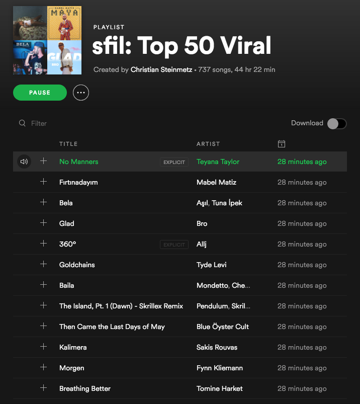

# sFilt
Python tool for filtering and sorting Spotify tracks based on existing playlist

## Setup

Install spotipy

`$ pip install spotipy`

Create the `keys.json` file and set your `client_id` and `client_secret` after [creating a Spotify API Client ID](https://beta.developer.spotify.com/dashboard/applications).

```
{
    "client_id" : "YOUR_CLIENT_ID",
    "client_secret" : "YOUR_CLIENT_SECRET",
    "redirect_uri" : "http://localhost:8888/callback"
}
```
## Viral playlist filtering

Currently this script is setup to pull the top 50 viral tracks from each Spotify country chart ( listed in [viral_50.json](viral_50.json) ) and then compare these tracks with the tracks on the Global Viral 50 and US Viral 50 charts. Any tracks that match are discarded and then a list of tracks not on the Global or US charts remain. Next these tracks are sorted based upon their popuality or on the distance of their feature vectors ( using [Spotify audio features](https://developer.spotify.com/documentation/web-api/reference/tracks/get-audio-features/) ).



Here is an example of a filtered playlist sorted by features vectors.

## Usage

Simply run the `sfilt.py` script

`$ python sfilt.py`

This will save a new playlist to your Spotify account.

## Note
This code is based upon the code in [sBucket](https://github.com/csteinmetz1/sBucket).
I am planning on building this out to be a more general purpose (modular) library that enables easy playlist filtering and generation on Spotify.
